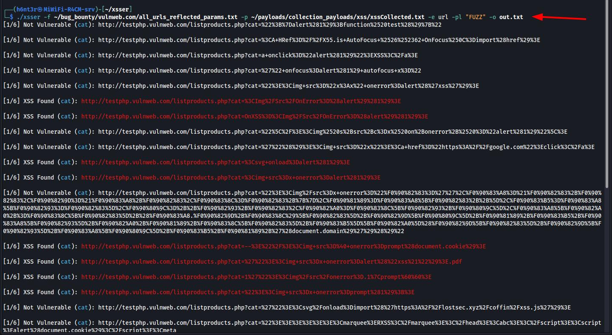
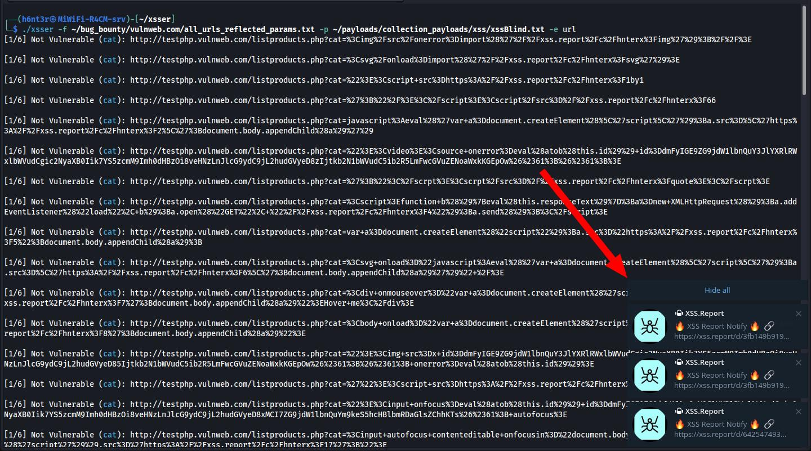

# 🚀 Advance XSS Scanner

A fast, XSS scanning tool with payload injection and a silent mode for clean output. Below highlights features, usage, examples and tips in a compact, eye-catching style.
## Reflected XSS pinpoint injection

## Blind XSS


---
## 💡 Type of XSS scanning 💡

* ✨ **Reflected XSS**
* 👨‍🦯 **Blind XSS**
* 🗂️ **Stored XSS**


---

## 🔥 Features 🔥

* ⚡️ **Fast Scan**
* 🔀 **Parallel Scanning**
* 🎯 **Accurate Result**
* 🚀 **Stdio/Piping mode**
* 🔗 **Single URL Scaning mode**
* 📂 **File scanning mode**
* 📦 **Custom Payload mode**
* 📌 **Pinpoint/Specific Parameter Injection mode**
* ⚙️ **Encoding Mechanism**
* 🤫 **Silent mode**
* 💾 **Output saving**

---

## 🚩 Quick Usage
## Piping mode
```
echo "http://testphp.vulnweb.com/listproducts.php?cat=a&dog=1" | xsser -p payloads.txt -o out.txt
```
## Single URL
```
xsser -u "http://testphp.vulnweb.com/listproducts.php?cat=a&dog=1" -p payloads.txt -o out.txt
```
## File of URLs
```
xsser -f urls.txt -p payloads.txt -o out.txt
```
## File of URLs with `specific injection point`
```
http://testphp.vulnweb.com/listproducts.php?cat=FUZZ&dog=1
http://testphp.vulnweb.com/login.php?id=FUZZ
http://testhtml5.vulnweb.com/comment?id=FUZZ
```
```
xsser -f urls.txt -p payloads.txt -pl "FUZZ" -o out.txt
```
## My favourite command
```
xsser -f urls.txt -p payloads.txt -pl "FUZZ" -e url -o out.txt
```

## 🧭 Options:

```
Advance XSS Scanner v4.0.1
Developed by: github.com/h6nt3r

Flags:
 -u string single URL to scan
 -f string file with URLs (one per line)
 -p string payload file (one per line) (required)
 -pl string keyword: only scan parameters(FUZZ) whose value contains this keyword (silent skip otherwise)
 -t int number of worker threads (default 5)
 -T int timeout seconds per test (default 10)
 -e string encoding mechanisms (comma-separated, e.g., url,base64)
 -s silent: only print URLs; white for Not Vulnerable, red for XSS Found
 -o string output file (plain text, only XSS found URLs)
```

---
## Prerequisite
* Install google-chrome
```
sudo wget "https://dl.google.com/linux/direct/google-chrome-stable_current_amd64.deb"
sudo apt --fix-broken install -y
sudo apt update --fix-missing
sudo apt install ./google-chrome-stable*.deb -y
```
* Delete google-chrome `.deb` file
```
sudo rm -rf ./google-chrome-stable*.deb
```
## 📦 Installation

1. Install Go (1.20+ recommended).
2. Install Chrome/Chromium on your machine.
```
go install -v github.com/h6nt3r/xsser@latest
```
### Build binary
```
git clone https://github.com/h6nt3r/xsser.git
cd xsser
go mod init main.go
go mod tidy
go build -o xsser *.go
sudo mv xsser /usr/local/bin/
cd
xsser -h
```

## ⏳Upcomming features

* 50+ Encoding mechanism
* Many more....
